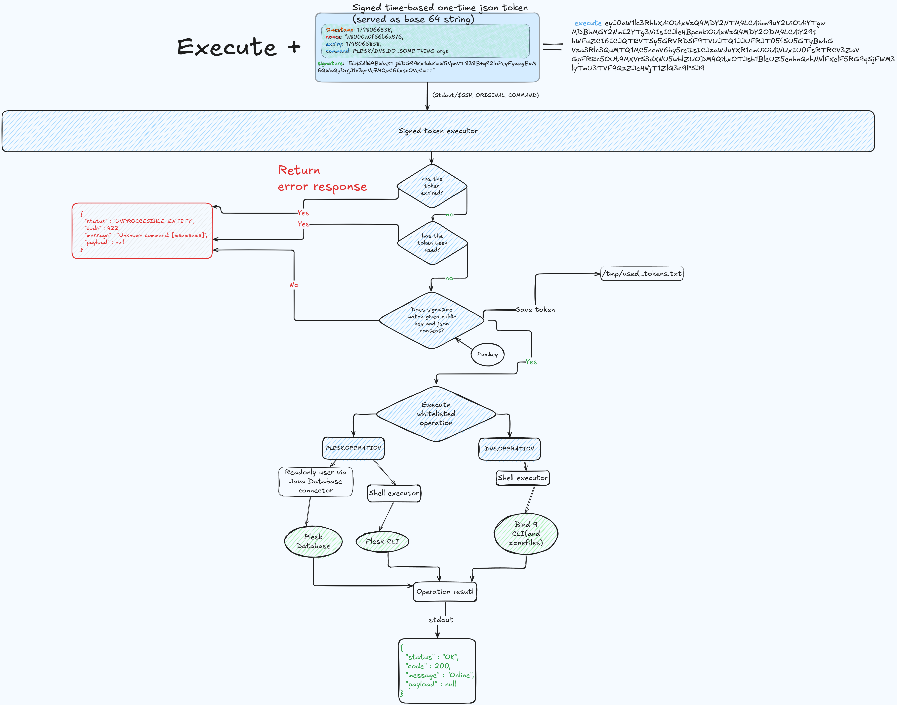

# Description

A secure wrapper for executing privileged commands related to Plesk and BIND server administration. Commands to execute
passed via signed tokens encoded with Base64. [Example of generator](https://github.com/HossBigft/signedTokenGenerator)

#Diagram

# Building the Binary

To compile the binary, run:

```bash
mvn clean package -Pprod
```

For faster builds during development, use:

```bash
mvn clean package -Pdev
```

# Behavior on First Run with `init`

The wrapper automatically creates:

- A log directory at `/var/log/APP_NAME`

- A configuration file at `~/.APP_NAME` (inside the user's home directory)

- A sudoers entry at `/etc/sudoers.d/APP_NAME`, granting passwordless sudo rights to the user who owns the app's home
  directory

- A read-only MySQL database user named after the app, with access to all databases
- Used token saved to `/tmp/used_tokens.txt`